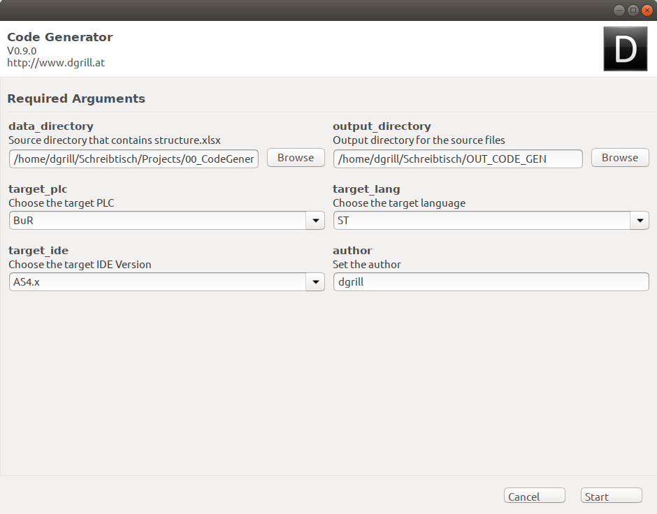

# Codegenerator for PLC´s

In Development

## GUI Interface



## Supported PLC´s

* B&R Automation Studio 4.x.x  
  * Structured Text (ST)
  * C++ (CPP) 
* Siemens TIA_V15
  * Structured Text (ST)

### Supported platform
* Linux
  * Ubuntu 16.04
  * Ubuntu 18.04
* Windows 7, 10 

### Install for Development

* Install Python runtime
  * Windows [https://www.python.org/downloads/windows/](https://www.python.org/downloads/windows/)
  * Linux [https://docs.python-guide.org/starting/install3/linux/](https://docs.python-guide.org/starting/install3/linux/)
  
* Install development dependencies 
```bash
$ pip install setup.py
```

### Build from Source

* Install pyinstaller [https://www.pyinstaller.org/](https://www.pyinstaller.org/)
```bash
$ pyinstaller build.spec
```


